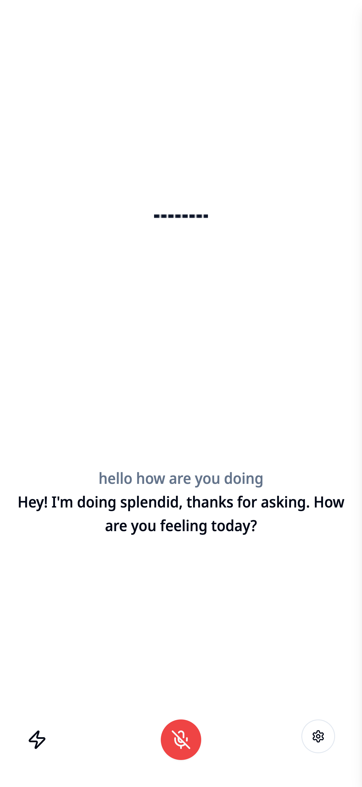
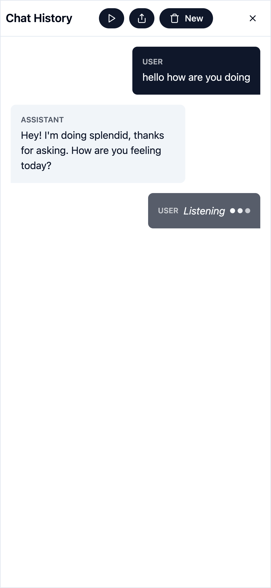
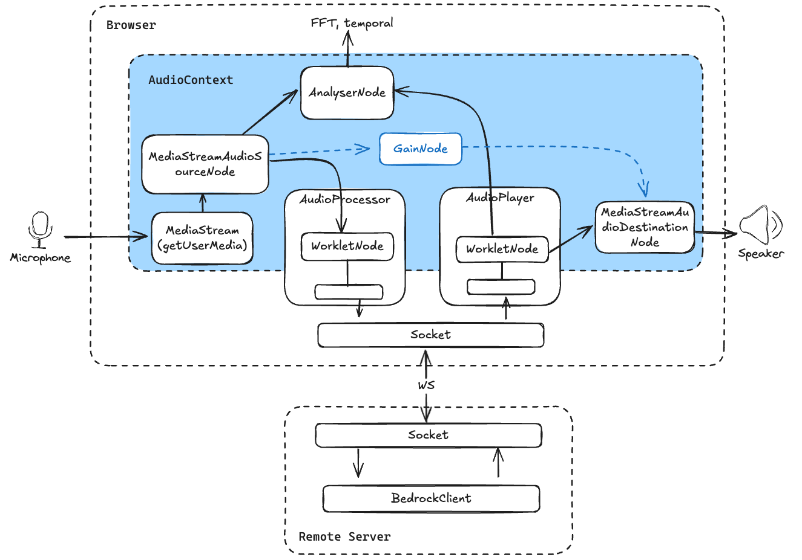
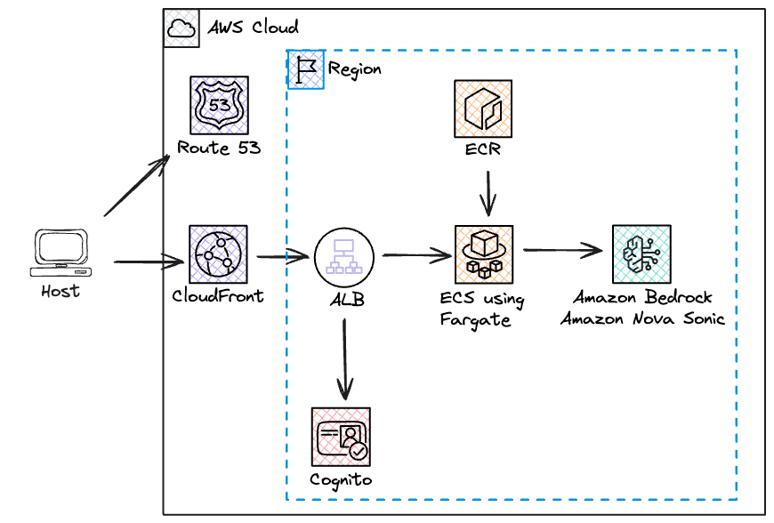

# Amazon Nova Sonic Chat: A Real-Time Voice Chat Application with Amazon Bedrock Integration

Amazon Nova Sonic Chat is a modern web-based voice chat application that enables real-time audio conversations with an AI assistant powered by Amazon Nova Sonic via Amazon Bedrock. The application features bidirectional streaming, audio visualization, and a responsive user interface with support for both light and dark themes.

The application combines WebSocket-based real-time communication, Web Audio API for audio processing, and AWS infrastructure for scalable deployment. Key features include:

- Real-time voice interaction with AI using Amazon Bedrock
- Audio visualization with spectrum analyzer
- Configurable audio settings including echo suppression and noise reduction
- Progressive Web App (PWA) support for offline functionality
- Secure authentication using Amazon Cognito
- Responsive UI with swipe gestures and theme customization
- Chat history management and system prompt configuration

## Repository Structure

```
.
├── packages/
│   ├── api/                   # Backend API server implementation
│   │   ├── src/              # Source files for API server
│   │   └── public/           # Static files served by API
│   ├── cdk/                  # AWS CDK infrastructure code
│   │   ├── bin/             # CDK app entry point
│   │   ├── lib/             # Stack definitions
│   │   └── docker/          # Docker configuration for deployment
│   └── web/                 # Frontend React application
│       ├── src/             # React components and application logic
│       ├── public/          # Static assets and worklet files
│       └── docs/            # Documentation files
├── pnpm-workspace.yaml      # PNPM workspace configuration
└── turbo.json              # Turbo monorepo configuration
```

## Usage Instructions

### Prerequisites

- Node.js 18 or later
- PNPM package manager
- AWS Account with appropriate permissions
- AWS CLI configured with credentials
- Domain name registered in Route53 (for deployment)

### Installation

1. Clone the repository and install dependencies:

```bash
git clone <repository-url>
cd nova-sonic-chat
pnpm install
```

2. Set up environment variables:

```bash
# API configuration
export AWS_PROFILE=<any profile with the right permission>
export AWS_REGION=us-east-1

# CDK deployment
export CDK_DEFAULT_ACCOUNT=<your-aws-account>
export CDK_DEFAULT_REGION=<your-aws-region>
export DOMAIN_NAME=<your-domain-name>
export API_NAME=<api-subdomain>
```

You can then deploy the backend via:

```bash
pnpm build
cd packages/cdk
pnpm copy-assets
npx cdk deploy
```

### Configure users

Once the deployment is finished, open the URL which has been printed to the terminal and add a new user to the Cognito User Pool.

### Accessing the application

Open the Application URL in your browser (Chrome or Safari, Firefox is not supported) or mobile phone and login with the generated password or predefined password.


On the first access you will be asked to set a new password.

### Using the application

The application has a minimalistic interface


The flash icon at the bottom left indicates that you have connectivity to the backend. When stroke out, it indicates connectivity is missing.

The configuration button allows you to set different properties of the application, like the system prompt (you can choose among 3 predefined ones or write your own), the voice to use, and other settings.

Select the mic button to talk with the chatbot. The live transcription of your speech and the bot speech appears on screen.



Press the button again to stop capturing the audio. You can press it again to continue the conversation.

The conversation history can be accessed by swiping to the left on the mobile screen or by clicking on the message bubble on the right of the screen on desktop.



Here you can replay the audio of the conversation and download the recording. Use New to start a new conversation.

## Local development

1. Start the development environment:

```bash
pnpm dev
```

2. Access the application (only Chrome or Safari are supported):

- Frontend: http://localhost:5173
- Backend API: http://localhost:3000

The backend provides a `/stats` endpoint which can be used to monitor the correct reception of the audio messages. It returns an array of 60 values, each one representing the number of audioInput messages per second received in the last minute.

The frontend is a PWA deployable app. On touch screens, you can swipe right to show the current chat history.

The application allows you to set the system prompt and the voice to use. It provides extensive control for the audio input and output and a test functionality to allow you test the audio setup.

The application manages 1 single chat session. The session can be stopped and resumed at any time. Due to the way that the server is currently implementing the Sonic API session management (1 websocket connection = 1 session), we disconnect and reconnect to the websocket to create new sessions, which is not optimal, but works just fine.
To start a new session, open the chat history (swipe left on mobile) and select the New button which clears the history and starts with a clean slate.

Compared to the sample implementation available in https://github.com/aws-samples/amazon-nova-samples/tree/main/speech-to-speech/sample-codes/websocket-nodejs , we have done few improvements:

- decoupled the socket connection from starting the Nova Sonic session
- implemented the `history` message to send previous history, thus enabling session resume
- rewritten completely the audio handling in the browser for additional flexibility and removal of deprecated functions



The current sample comes with several tools:

- `getTimeTool` - provides current time information
- `getDateTool` - provides current date information
- `webSearchTool` - allows searching the web using Google Custom Search API

We also noticed that Nova Sonic sometimes would ask for `gettimetoolgetdatetool` which in the original implementation caused the conversation to stop due to an unhandled exception. We now return an error message to Nova Sonic in case it mentions a non supported tool, but we also try to optimistically find any of the tools we know about in what Nova Sonic ask, and run the first one we find.

### Web Search Tool Configuration

The `webSearchTool` uses Google Custom Search JSON API to search the web. To use this tool, you need to:

1. Create a Google API key:

   - Go to https://console.cloud.google.com/
   - Create a new project or select an existing one
   - Navigate to "APIs & Services" > "Credentials"
   - Click "Create credentials" > "API key"
   - Copy the generated API key

2. Create a Custom Search Engine:

   - Go to https://programmablesearchengine.google.com/
   - Click "Create a search engine"
   - Configure your search engine (select sites to search or search the entire web)
   - Get your Search Engine ID (cx) from the "Setup" > "Basic" section

3. Add these values to your `.env` file:
   ```
   GOOGLE_API_KEY="your-api-key-here"
   GOOGLE_SEARCH_ENGINE_ID="your-search-engine-id-here"
   ```

## Defining New Tools

You can extend the AI assistant's capabilities by creating new tools. Tools are classes that provide specific functionality that can be invoked by the AI during conversations.

### Tool Structure

1. Create a new tool class in `packages/api/src/tools/` that extends the base tool class:

```typescript
import { ToolBase } from "./toolBase";

export class MyNewTool extends ToolBase {
  public name = "getMyNewTool";
  public description = "Description of what the tool does";

  async run(params?: string): Promise<any> {
    // Implement tool logic here
    return {
      result: "Tool output",
    };
  }
}
```

2. Register the tool in `packages/api/src/tools/index.ts` or in the same file where yo u defined the tool:

```typescript
import { MyNewTool } from "./myNewTool";
import { ToolRunner } from "./toolRunner";

// Register the new tool
ToolRunner.getInstance().registerTool(new MyNewTool());
```

## Using MCP (Model Context Protocol) Tools

The application includes a built-in MCP (Model Context Protocol) tool management interface, allowing you to extend the AI assistant's capabilities by connecting to external APIs and services without any coding.

### Accessing MCP Tool Management

1. Open the application and click the **configuration button** (⚙️)
2. Scroll to the **External Tools** section
3. Click **Manage MCP Tools** to open the tool management panel

### Adding a New MCP Tool

To add an MCP tool, you'll need the following information from your MCP service provider:

- **Tool Name**: A descriptive name (e.g., "Weather API")
- **Tool Endpoint**: The URL where the tool can be accessed (e.g., `https://api.example.com/weather`)
- **Client ID**: Your OAuth client identifier
- **Client Secret**: Your OAuth client secret (stored securely and encrypted)
- **Additional instructions**: You can provide additional instructions that are appended to the tools results from this server

**Steps to add a tool:**

1. Click the **Add Server** button
2. Fill in all required fields
3. Optionally add a description to help you remember what the tool does
4. Toggle **Enable tool** if you want it active immediately
5. Click **Create Tool**

The tool will be validated and made available to the AI assistant automatically.

### Managing Your Tools

Once tools are added, you can:

- **Test Connection**: Click the test tube icon (🧪) to verify the tool is working and OAuth is configured correctly
- **Edit Tool**: Click the edit icon (✏️) to update configuration (you can change everything except the secret will only update if provided)
- **Delete Tool**: Click the trash icon (🗑️) to remove a tool permanently
- **Enable/Disable**: Toggle tools on/off without deleting them

### Using Tools in Conversations

Once an MCP tool is added and enabled:

1. The AI assistant automatically knows about the tool and its capabilities
2. During voice conversations, the AI will use the tool when appropriate
3. You'll see tool calls reflected in the conversation history
4. Tool responses are seamlessly integrated into the AI's answers

For example, if you've added a weather tool, you can simply ask "What's the weather like in London?" and the AI will automatically call your weather tool to get real-time data.

### Tool Security

- Client secrets are encrypted using AWS KMS and stored securely in Parameter Store
- OAuth tokens are cached in memory only and automatically refreshed
- All tool communications use secure HTTPS connections
- Tools can be disabled at any time without losing configuration

### Troubleshooting

**Tool shows error status:**

- Click the test button to see the specific error
- Verify your Client ID and Secret are correct
- Check that the OAuth Token Endpoint is accessible
- Ensure your tool endpoint is reachable

**AI doesn't use my tool:**

- Verify the tool is enabled (green checkmark)
- Make sure your request is relevant to the tool's capability
- Check that the tool description clearly explains its purpose

**Tool test fails:**

- Verify connectivity to the tool endpoint
- Check OAuth credentials with your service provider
- Ensure required scopes are configured correctly

For detailed technical documentation about MCP integration, see [packages/api/MCP_INTEGRATION.md](packages/api/MCP_INTEGRATION.md).

## Infrastructure

The application can be deployed using AWS CDK with the following resources:

ECS:

- Application Load Balanced Fargate Service
- Docker container for API server
- Task role with Bedrock permissions

ECR:

- stores the image for the task

ACM:

- certificate for the server domain

Cognito:

- User Pool for authentication
- User Pool Domain for hosted UI

Route53:

- Hosted zone configuration
- DNS records for API endpoints

The application resources are all served by the Fargate container hosted behind and ALB with Cognito authentication enforced. This allow to securely serve the API with minimal operational effort, and minimal latency. The only requirement is to have registered the FQDN (Fully Qualified Domain Name) to be used as Hosted Zone in Route53 of the account. The solution requests automatically a certificate from Amazon Certificate Manager (ACM) for the sub-domain being used.



## Deployment

1. Build the application:

```bash
pnpm build
```

2. Deploy infrastructure:

```bash
cd packages/cdk
pnpm copy-assets
BUILDX_NO_DEFAULT_ATTESTATIONS=1 AWS_PROFILE=abc AWS_REGION=us-east-1 DOMAIN_NAME=example.com API_NAME=sonic-chat npx cdk deploy
```

NOTE: `BUILDX_NO_DEFAULT_ATTESTATIONS=1` is required on Mac OS with the latest Docker Desktop to enable the correct push of the image to ECR. Other solutions might not need it.

# NOTES on iOS

- When selecting Echo Suppression/Cancellation the main speaker is selected and volume is usually high - do not hold the phone at the ear. The mic is also applying a lot of gain to the voice (as it can be seen from the bars).
- When deselecting Echo Suppression the earpiece speaker is selected. One has to hold the phone near the ear to hear something. Use headphones with this setup

This software and documentation has been written with the help of Cline (Claude 3.7) and Amazon Q Chat.

## Security

See [CONTRIBUTING](CONTRIBUTING.md#security-issue-notifications) for more information.

## License

This library is licensed under the MIT-0 License. See the [LICENSE](./LICENSE) file.
